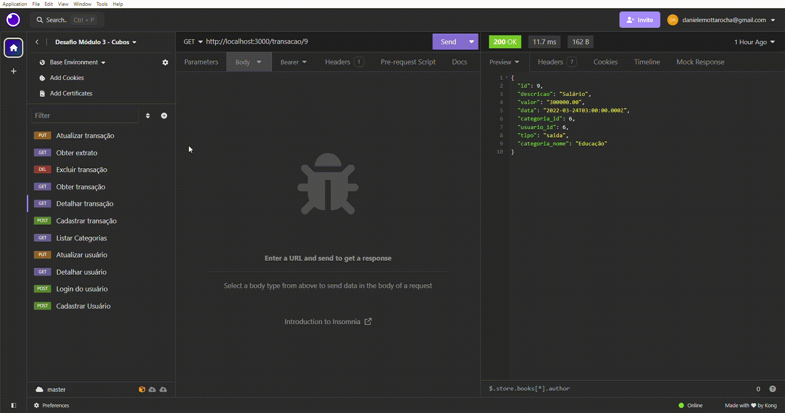

<div align="center">
  <h1>API Dindin</h1>
</div>


## Descrição
Dindin é uma RESTful API construída como parte do Desafio Back-end do Módulo 3 da Cubos Academy. 
Utilizando a linguagem JavaScript, a API foi desenvolvida com o framework Node.js e utiliza o PostgreSQL como seu sistema de gerenciamento de banco de dados.
Seu objetivo é gerenciar transações financeiras, permitindo aos usuários realizar operações como cadastro, login, edição, remoção de transações, dentre outras.


## Funcionalidades
- Cadastrar usuário
- Fazer login
- Detalhar perfil do usuário logado
- Editar perfil do usuário logado
- Listar categorias
- Listar transações
- Detalhar transação
- Cadastrar transação
- Editar transação
- Remover transação
- Obter extrato de transações

## Dependências Utilizadas
- express.js: Fornece uma série de recursos para lidar com rotas, middlewares, requisições HTTP, entre outros.
- bcrypt: É uma biblioteca utilizada para hash de senhas, garantindo a segurança das informações dos usuários.
- dotenv: Biblioteca que carrega variáveis de ambiente de um arquivo .env para o processo do Node.js, permitindo configurar variáveis de ambiente como credenciais de banco de dados, etc.
- jsonwebtoken: Permite autenticar e autorizar usuários de forma segura.
- nodemon: Reinicia automaticamente o servidor durante o desenvolvimento sempre que arquivos do projeto são modificados, facilitando o processo de desenvolvimento.


## Como executar o projeto
### Pré-requisitos
Antes de começar, você vai precisar ter instalado em sua máquina as seguintes ferramentas:
[Git](https://git-scm.com) e [VSCode](https://code.visualstudio.com/)

Para executar este projeto localmente, siga estas etapas:

1) Faça um clone do projeto
```bash
git clone https://github.com/dxnielemotta/dindin
```
2) Abra o diretório do projeto
```bash
cd dindin
```

3) Instale as dependências utilizando o comando:
```bash
npm install
```

4) Configure as variáveis de ambiente:
- Crie um arquivo .env no diretório raiz
- Adicione as seguintes variáveis de ambiente:
  
  ```
  DB_USER=seu_usuario_do_banco_de_dados
  DB_PASSWORD=sua_senha_do_banco_de_dados
  DB_DATABASE=dindin
  PORT=5432
  ```
- Substitua `seu_usuario_do_banco_de_dados` e `sua_senha_do_banco_de_dados` pelas credenciais do seu banco de dados PostgreSQL.


5) Inicialize o servidor local: 
```bash
npm run dev
```
Agora que o servidor está em execução, você pode acessar os endpoints da API usando um cliente HTTP, como o Postman ou o Insomnia, para enviar requisições HTTP para os endpoints listados no arquivo, como /usuario, /transacao, etc.

## Endpoints

#### `POST` `/usuario`: Cadastra um novo usuário


#### `POST` `/login`: Faz login do usuário


#### `PUT` `/usuario`: Atualiza informações do usuário


#### `GET` `/transacao`: Obtém todas as transações


#### `GET` `/transacao/:id`: Obtém detalhes da transação por ID


#### `POST` `/transacao`: Registra uma nova transação


#### `PUT` `/transacao/:id`: Atualiza uma transação por ID


#### `DELETE` `/transacao/:id`: Exclui uma transação por ID


#### `GET` `/transacao/extrato`: Obtém extrato da conta


## Tecnologias Utilizadas
[](https://skillicons.dev)


## Licença
[MIT](LICENSE)
